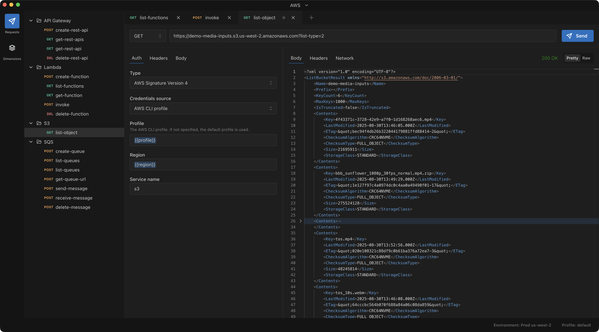

# Inflight - *Delightful REST API Client*



Inflight is a desktop REST API client that focuses on security, privacy, and ease of use. The
application is available for Mac, Windows, and on the web.

Download Inflight from https://inflight.dev.

The following are some of the reasons Inflight is awesome:

- **Simplicity**: No account or sign up required to get started.
- **Security**: Implements and facilitates security best practices, such as temporary credentials.
- **Privacy**: Work with offline project; no sending your project or data to remote server.
- **Powerful**: Supports powerful user-defined request dimensions instead of inflexible
  environments.

## Support

For questions regarding using Inflight, see the
[official documentation](https://www.inflight.dev/docs/getting-started).

If your question or issue remains unresolved after reading the docs, please
[submit an issue](https://github.com/wangchj/inflight/issues) in this repository.

## Development

This section describes how to run and build Inflight from source (this repo) for development. This
package currently require Node 20 and `npm` is required for development.

Run the following to get the repo and get started:

```bash
git clone git@github.com:wangchj/inflight.git
npm install
```

The following are common npm targets (defined in `package.json`):

```bash
npm run start                     # Runs application in development mode
npm run make -- --arch=x64,arm64  # Makes release distributable packages
npm run server                    # Runs web build development server
npm run make-web                  # Makes web build
```
